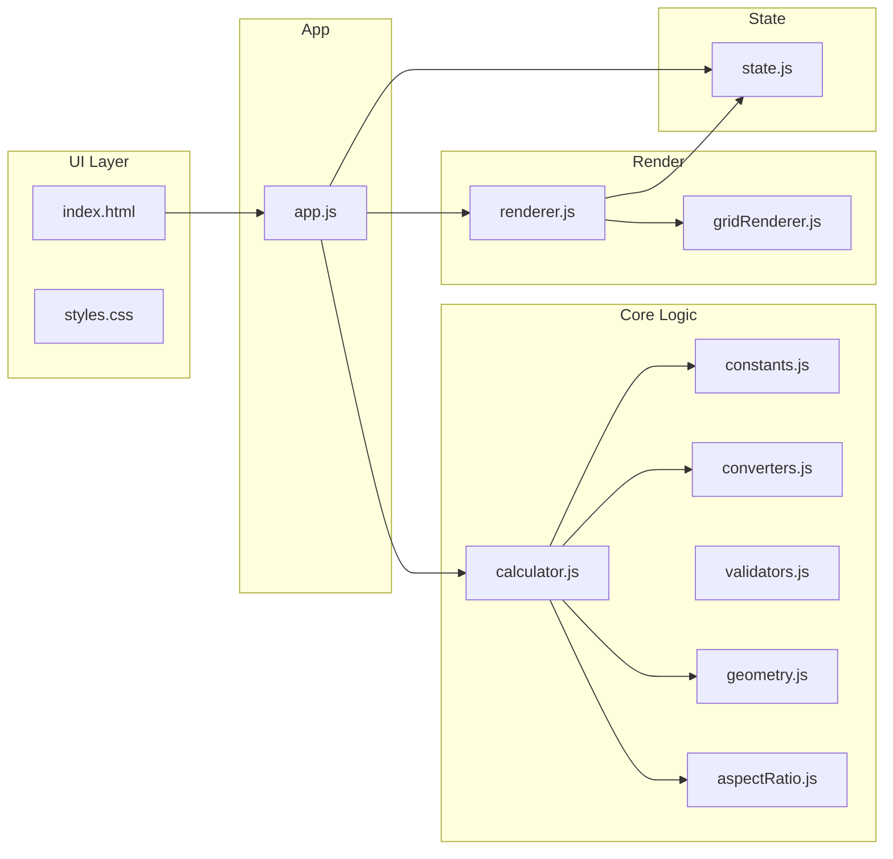

# Video Wall Size Calculator – Implementation Plan

## Architecture Overview

- **Single entry:** [index.html](index.html) loads [js/app.js](js/app.js) as `type="module"`.
- **State:** Only [js/state.js](js/state.js) holds mutable app state; no other globals.
- **Flow:** User actions → `app.js` updates state and/or calls calculator → `renderer.js` and `gridRenderer.js` update DOM from state.

---

## 1. File Roles and Data Flow

| File                   | Purpose                                                                                                                                                                                                                                                                                                                                                                                                                                                                                                                                                                                                                                                                                |
| ---------------------- | -------------------------------------------------------------------------------------------------------------------------------------------------------------------------------------------------------------------------------------------------------------------------------------------------------------------------------------------------------------------------------------------------------------------------------------------------------------------------------------------------------------------------------------------------------------------------------------------------------------------------------------------------------------------------------------- |
| **index.html**         | Markup: cabinet type selector, two-of-four inputs (aspect ratio, height, width, diagonal), unit toggle, Apply button, results area (two cards: lower/upper), grid placeholders, confirmation section. Single script: `js/app.js` (module).                                                                                                                                                                                                                                                                                                                                                                                                                                             |
| **css/styles.css**     | CSS variables (colors, spacing, radii, shadows), reset/base, centered card layout, form layout, result cards, grid visualization (CSS Grid), responsive rules. No UI libraries.                                                                                                                                                                                                                                                                                                                                                                                                                                                                                                        |
| **js/state.js**        | One state object (frozen or single export). Fields: `cabinetType` ('16:9'                                                                                                                                                                                                                                                                                                                                                                                                                                                                                                                                                                                                              |
| **js/constants.js**    | Cabinet specs in mm: `CABINETS = { '16:9': { width: 600, height: 337.5 }, '1:1': { width: 500, height: 500 } }`. Aspect ratio presets (e.g. 16:9, 4:3, 1:1) for dropdown. Conversion factors **to mm**: e.g. `MM_PER_M`, `MM_PER_FT`, `MM_PER_IN`. Export constants only.                                                                                                                                                                                                                                                                                                                                                                                                              |
| **js/converters.js**   | Pure functions: `valueToMm(value, unit)`, `mmToValue(mm, unit)`. Used for all I/O and internal math. Unit change in state triggers re-display of stored values in new unit and re-run of calculator with mm.                                                                                                                                                                                                                                                                                                                                                                                                                                                                           |
| **js/validators.js**   | `getActiveInputCount()`, `canSelectInput(id)` (true if < 2 selected or id already selected). `validateNumeric(value)` (non-empty, finite number). Used by app before enabling/disabling inputs and before Apply.                                                                                                                                                                                                                                                                                                                                                                                                                                                                       |
| **js/geometry.js**     | Given two of { width, height, diagonal, aspectRatio } (all in mm or ratio as number), derive the rest. Formulas: `diagonal = sqrt(w^2 + h^2)`, `aspectRatio = w/h`, so e.g. from width + diagonal → height = sqrt(d^2 - w^2). Export functions like `deriveDimensions(known)` returning { width, height, diagonal, aspectRatio } in mm (and ratio). Comment each formula.                                                                                                                                                                                                                                                                                                              |
| **js/aspectRatio.js**  | Preset list and helpers: e.g. `getPresetRatio(label)` → number, `closestPreset(ratio)`. Used when “aspect ratio” is one of the two selected inputs and for displaying “final aspect ratio” in results.                                                                                                                                                                                                                                                                                                                                                                                                                                                                                 |
| **js/calculator.js**   | **Orchestrator.** (1) Read state: cabinet type, which two inputs, values in current unit. (2) Convert to mm and optional target aspect ratio via [converters.js](js/converters.js) and [geometry.js](js/geometry.js). (3) Estimate initial cols/rows: e.g. `cols0 = targetWidth / cabinetWidth`, `rows0 = targetHeight / cabinetHeight`. (4) Generate candidate grids: e.g. (cols0±k, rows0±k) for small k, bounded (e.g. 1–200). (5) For each candidate compute: final width, height, diagonal, aspect ratio (all from cols/rows × cabinet dimensions). (6) Score: `dimensionError + weight * ratioError` (e.g. dimension = sum of relative errors for width/height/diagonal; ratio = |
| **js/renderer.js**     | Functions to sync DOM with state: render form (enable/disable inputs per “two at a time”, show values in current unit), render unit toggle, render result cards (columns, rows, total cabinets, final width/height/diagonal/ratio in current unit), call gridRenderer for each result, render “select & confirm” and final chosen config. No business logic; read from state and constants/converters for display.                                                                                                                                                                                                                                                                     |
| **js/gridRenderer.js** | Given container element and `{ cols, rows }`, clear container and build a CSS Grid (e.g. `grid-template-columns: repeat(cols, 1fr)`), with `cols × rows` cell divs. Minimal styling (border or background) so it’s clearly a grid.                                                                                                                                                                                                                                                                                                                                                                                                                                                     |
| **js/app.js**          | Init: read DOM refs, bind events (cabinet type, unit, input focus/change, Apply, “Select” per result). On input selection: validate with validators, update state (which two active, values), then call renderer. On unit change: convert displayed values via state (store in mm or in current unit consistently), update state.unit, re-render and optionally re-run calculator. On Apply: validate two inputs and numeric values, convert to mm, call calculator, write state.results, render. On Select: set state.selectedConfig, render. No inline JS in HTML.                                                                                                                   |

---

## 2. Two-Input Rule and UX

- State tracks which two inputs are “active” (e.g. aspect ratio + height).
- On click/change of an input’s checkbox or dropdown: if already active, unselect; if inactive and currently < 2 active, activate; if already 2 active, do nothing (or show message). Validators enforce “only two.”
- When two are active: disable the other two inputs in the DOM; show current values for the two active; “Apply” uses only those two.
- Clear labels: “Select exactly two parameters.”

---

## 3. Unit Toggle and Real-Time Conversion

- Store in state either (a) values in current unit and current unit, or (b) values in mm and current unit (recommended: store in mm after first conversion so one source of truth). On unit change: state.unit changes; display uses `mmToValue(..., state.unit)` everywhere; re-run calculator with same mm values so results stay consistent; display results in new unit.
- All displayed numbers (inputs and results) go through [converters.js](js/converters.js) so one place defines precision (e.g. 2 decimals for inches/feet).

---

## 4. Core Logic (Calculator) Detail

- **Input to mm:** Use the two selected inputs. If one is aspect ratio, treat it as constraint; the other (height, width, or diagonal) gives scale. Use [geometry.js](js/geometry.js) to get target width, height, diagonal in mm.
- **Candidates:** From `cols0 = round(targetWidth / cabW)`, `rows0 = round(targetHeight / cabH)`, generate (cols, rows) for cols in [cols0−δ, cols0+δ], rows in [rows0−δ, rows0+δ], with sensible bounds (e.g. 1–200) and optionally expand if no lower/upper found.
- **Scoring:** For each candidate, compute final w, h, d, ratio. Dimension error e.g. `|finalW − targetW|/targetW + same for H and D` (or normalized). Ratio error `|finalRatio − targetRatio|`. Combined: `score = dimensionError + k * ratioError` (k chosen so both matter). Lower = candidate with total size ≤ target (or exact) and minimum score; Upper = total size ≥ target and minimum score. Exact match: that candidate is lower; then pick smallest above as upper.
- **Edge cases:** Very small target → upper may be (1,1); very large → cap search; no exact ratio (e.g. 1:1 cabinets for 16:9) → still return closest lower/upper and show actual ratio clearly.

---

## 5. Display and Grid Visualization

- **Result cards:** One card “Closest lower” and one “Closest upper.” Each shows: columns, rows, total cabinets, final width, height, diagonal, final aspect ratio (in current unit except ratio). Below each card, a dedicated container for the grid.
- **Grid:** [gridRenderer.js](js/gridRenderer.js) creates a div with `display: grid`, `grid-template-columns: repeat(cols, 1fr)`, N×M cells. Reuse for both lower and upper; call from renderer with the right container and config.

---

## 6. Select and Confirm

- Each result card has a “Select” (or “Use this”) button. On click, set `state.selectedConfig` to that config and re-render. A “Confirmation” or “Chosen configuration” section shows the selected one (same fields + grid) and stays visible until user picks another or clears.

---

## 7. Code and UI Standards

- **No inline JS:** All behavior in [js/app.js](js/app.js) and modules.
- **No globals** except the state module’s exported state API.
- **Comments:** Especially in [js/geometry.js](js/geometry.js) (formulas) and [js/calculator.js](js/calculator.js) (scoring and lower/upper selection).
- **CSS:** Variables in [css/styles.css](css/styles.css) for colors, spacing, shadows; centered card; responsive (stack form/buttons on small screens); clear typography; no framework or UI library.

---

## 8. Suggested Order of Implementation

1. **Scaffold:** Create folder structure, [index.html](index.html) (structure + script module), [css/styles.css](css/styles.css) (variables + base + card).
2. **State and constants:** [js/state.js](js/state.js), [js/constants.js](js/constants.js).
3. **Converters and validators:** [js/converters.js](js/converters.js), [js/validators.js](js/validators.js).
4. **Geometry and aspect ratio:** [js/geometry.js](js/geometry.js), [js/aspectRatio.js](js/aspectRatio.js).
5. **Calculator:** [js/calculator.js](js/calculator.js) with candidate generation and scoring (start with one cabinet type and one input pair to verify).
6. **Grid renderer:** [js/gridRenderer.js](js/gridRenderer.js).
7. **Renderer:** [js/renderer.js](js/renderer.js) (form, results, confirmation).
8. **App:** [js/app.js](js/app.js) — wire events, state updates, calculator, renderer.
9. **Polish:** Two-input rule UX, unit toggle behavior, edge cases (no lower/upper, exact match), responsive and a11y (labels, focus).

---

## 9. Key Formulas (for implementation)

- **Width + Diagonal → Height:** `height = sqrt(diagonal^2 - width^2)` (in mm).
- **Height + Diagonal → Width:** `width = sqrt(diagonal^2 - height^2)`.
- **Aspect ratio r + one of W/H/D:** e.g. if width known, `height = width / r`; then `diagonal = sqrt(w^2 + h^2)`. Similar for height or diagonal.
- **Final dimensions from grid:** `finalWidth = cols * cabinetWidth`, `finalHeight = rows * cabinetHeight`, `finalDiagonal = sqrt(finalWidth^2 + finalHeight^2)`, `finalRatio = finalWidth / finalHeight`.

This plan keeps logic in pure modules, state in one place, and UI in renderer/gridRenderer, and satisfies the PDF and your file-structure and “no frameworks” requirements.