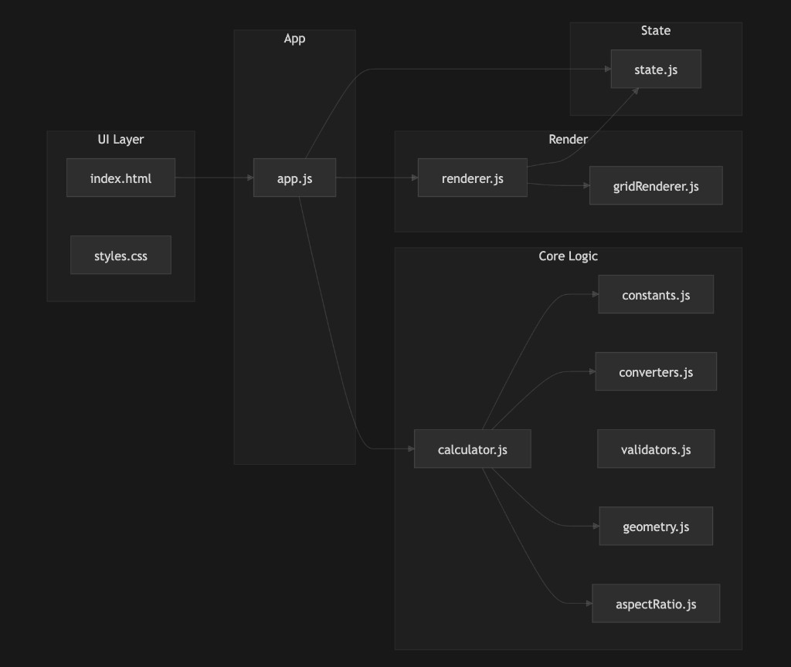

# Video Wall Size Calculator

A modular **Video Wall Size Calculator** built with HTML, CSS, and vanilla JavaScript (ES6 modules). It lets you choose two of four parameters (aspect ratio, height, width, or diagonal), pick units (mm, m, ft, in), and get the **closest lower** and **closest upper** cabinet grid configurations with grid visualizations and a confirmation flow.

**Live demo:** [https://video-wall-assignment.onrender.com/](https://video-wall-assignment.onrender.com/)

---

## Features

- **Cabinet types:** 16:9 (600 × 337.5 mm) or 1:1 (500 × 500 mm)
- **Two-parameter input:** Select exactly two of: Aspect ratio, Height, Width, Diagonal
- **Aspect ratio presets:** 16:9, 4:3, 1:1
- **Units:** mm, m, ft, in (all displayed values and results use the selected unit)
- **Results:** “Closest lower” and “Closest upper” grid configurations (columns × rows, total cabinets, final width/height/diagonal, aspect ratio)
- **Grid visualization:** CSS Grid preview for each result
- **Select & confirm:** Choose a configuration and see it in a “Chosen configuration” section
- **No frameworks:** Plain HTML/CSS/JS, no build step, no npm dependencies

---

## Architecture

- **Single entry:** `index.html` → `js/app.js` (module).
- **State:** Only `js/state.js` holds mutable app state; all other modules use its getters/setters.
- **Flow:** User actions → `app.js` updates state and/or calls `calculator.js` → `renderer.js` and `gridRenderer.js` update the DOM from state.

---

## Project Structure

| Path | Purpose |
|------|--------|
| `index.html` | Single entry: markup, form (cabinet type, two-of-four inputs, unit toggle, Apply), results area, confirmation section. Loads `js/app.js` as ES module. |
| `css/styles.css` | Variables (colors, spacing, radii), base styles, card layout, form, result cards, grid styling, responsive rules. |
| `js/app.js` | **Entry point.** DOM refs, event binding (cabinet type, checkboxes, inputs, unit, Apply), state updates, calls calculator and renderer. |
| `js/state.js` | **Single source of state.** Cabinet type, unit, active inputs (max 2), values in mm, aspect ratio preset, results (lower/upper), selected config. No globals elsewhere. |
| `js/constants.js` | Cabinet dimensions (mm), aspect ratio presets, unit conversion factors to mm, grid search bounds (min/max cols/rows, candidate radius). |
| `js/converters.js` | Pure functions: `valueToMm(value, unit)`, `mmToValue(mm, unit)`. All I/O and internal math use mm. |
| `js/validators.js` | `getActiveInputCount`, `canSelectInput`, `validateNumeric`, `hasTwoInputs`. Enforces “exactly two parameters” and valid numbers. |
| `js/geometry.js` | Given two of { width, height, diagonal, aspectRatio } in mm, derives the rest (e.g. diagonal = √(w² + h²), aspectRatio = w/h). |
| `js/aspectRatio.js` | Preset list and helpers: `getPresetRatio(label)`, `closestPreset(ratio)`. Used when aspect ratio is one of the two inputs. |
| `js/calculator.js` | **Core logic.** Converts inputs to target dimensions in mm, generates candidate grids (cols × rows), scores by dimension + ratio error, returns closest lower and upper configurations. |
| `js/renderer.js` | Syncs DOM with state: form (enable/disable inputs, show values in current unit), unit toggle, result cards, grid placeholders, confirmation section. |
| `js/gridRenderer.js` | Given a container and `{ cols, rows }`, builds a CSS Grid of cells for visual preview. |

---

## Two-Input Rule

- You must select **exactly two** parameters (Aspect ratio, Height, Width, Diagonal).
- Check the checkbox next to a parameter to activate it; uncheck to deactivate. When two are active, the other two are disabled.
- **Apply** uses only the two active inputs. Both must have valid numeric values (for height, width, diagonal); aspect ratio uses the selected preset.

---

## Units and Conversion

- **Stored internally:** All dimensions are stored in **millimetres (mm)**.
- **Display:** Inputs and results are shown in the selected unit (mm, m, ft, in). Conversion is done in `converters.js` (e.g. 1 m = 1000 mm, 1 ft = 304.8 mm, 1 in = 25.4 mm).
- Changing the unit updates the displayed numbers and re-renders results in the new unit; the underlying target size (in mm) stays the same.

---

## Calculator Logic (Summary)

1. **Target dimensions:** From the two active inputs, `geometry.js` derives target width, height, diagonal, and aspect ratio in mm.
2. **Candidates:** From approximate `cols0 = targetWidth / cabinetWidth` and `rows0 = targetHeight / cabinetHeight`, the calculator generates nearby grid sizes (e.g. within a small radius, bounds 1–200 cols/rows).
3. **Scoring:** Each candidate gets a score: relative dimension error (width, height, diagonal) plus a weighted aspect-ratio error. Lower score = better match.
4. **Lower/Upper:** **Closest lower** = best-scoring grid with total size ≤ target; **Closest upper** = best-scoring grid with total size ≥ target. If there’s an exact match, it’s treated as lower; the next larger grid is upper.

---

## Key Formulas

- **Diagonal:** `diagonal = √(width² + height²)`
- **Aspect ratio:** `aspectRatio = width / height`
- **From two of W, H, D, ratio:** e.g. width + diagonal → `height = √(diagonal² − width²)`; aspect ratio + one dimension fixes the other, then diagonal follows.
- **Grid dimensions:** `finalWidth = cols × cabinetWidth`, `finalHeight = rows × cabinetHeight`, `finalDiagonal = √(finalWidth² + finalHeight²)`

---

## Browser Support

- Modern browsers that support **ES6 modules** (e.g. `import`/`export`) and `type="module"` scripts. For local file opening, some browsers may require a local server due to CORS/module restrictions.

---

## License

This project is provided as-is for the video wall calculator assignment.
